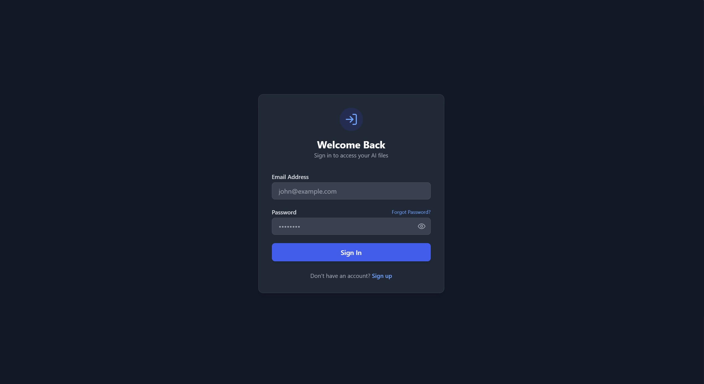
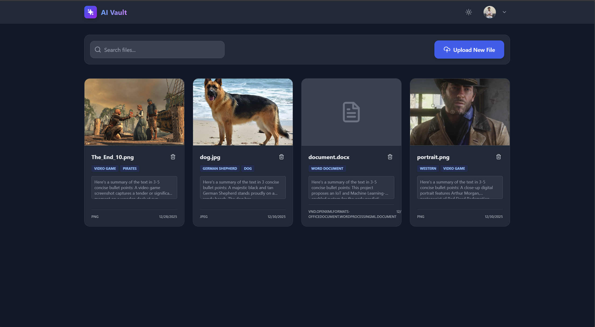
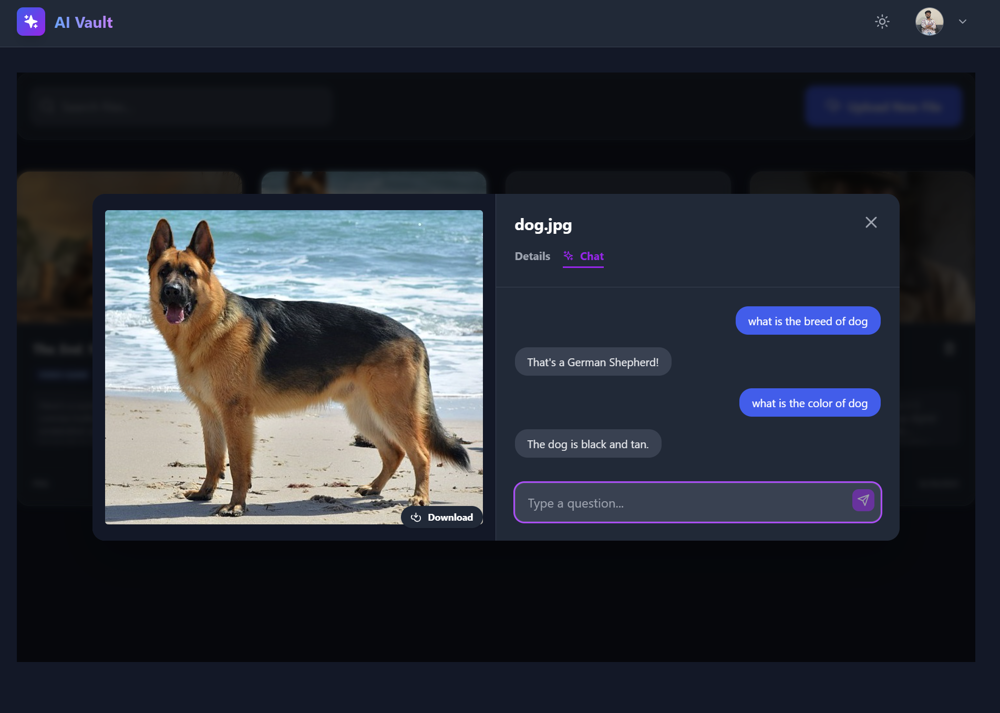

# 🤖 AI Vault — Intelligent Cloud Storage Platform


**AI Vault** is a secure, full-stack cloud storage platform that transforms traditional file storage into an **AI-powered knowledge system**.

Instead of simply storing files, AI Vault enables users to **extract insights, summarize content, generate metadata, and interact with documents using natural language** through Retrieval-Augmented Generation (RAG).


---

## 🏗️ Architecture Overview

The system is designed using a **containerized, service-oriented architecture**, ensuring scalability, modularity, and ease of deployment.

```mermaid
graph TD
  User[User Browser] -->|HTTPS| FE[React Frontend]
  FE -->|REST APIs| BE[Flask Backend]
  BE -->|ORM Queries| DB[(PostgreSQL)]
  BE -->|AI Requests| Gemini[Google Gemini API]
  BE -->|Media Storage| Cloud[Cloudinary]
  BE -->|Email OTP| SMTP[Gmail SMTP]
````

---

## ✨ Core Features

### 🧠 AI-Powered Intelligence

* **Document Chat (RAG):** Ask questions directly to uploaded files
  *Example: “Summarize this PDF” or “What is the total amount mentioned?”*
* **OCR Processing:** Extracts text from scanned PDFs and images
* **Auto-Summarization:** Generates concise summaries for large documents
* **Smart Tagging:** Automatically generates searchable metadata
* **Image Understanding:** AI-based captioning and visual analysis

---

### 🔐 Security & Access Control

* **JWT Authentication:** Secure stateless authentication with expiration
* **Role-Based Access Control (RBAC):** User and Admin roles
* **Admin Console:** Manage users, roles, and platform activity
* **Secure Password Reset:** Email-based OTP verification
* **Rate Limiting:** Protects APIs from abuse

---

### ⚙️ **Modern DX (Developer Experience)** 

* **Dockerized:** One command (docker-compose up) to spin up the entire stack.
* **Cloud Native:** Database on Neon (Serverless Postgres), Backend on Render.
* **Responsive:** Fully adaptive Dark/Light mode built with Tailwind CSS.

---

### 🎨 **Modern UI/UX** 
* **Responsive Design:** Seamless Dark/Light mode support.
* **Drag & Drop:** Intuitive file upload zone with Framer Motion animations.
* **Interactive Dashboard:** Real-time toast notifications and skeleton loaders.

---


## 🛠️ Technology Stack

| Layer               | Technology                                  |
| ------------------- | ------------------------------------------- |
| **Frontend**        | React 18, Vite, Tailwind CSS, Framer Motion |
| **Backend**         | Flask, SQLAlchemy, Marshmallow, Gunicorn    |
| **Database**        | PostgreSQL 15                               |
| **AI Engine**       | Google Gemini (Generative AI API)           |
| **Storage**         | Cloudinary (media files)                    |
| **DevOps**          | Docker, Docker Compose                      |
| **Auth & Security** | JWT, RBAC, SMTP OTP                         |

---


## 🧭 Application Flow (At a Glance)

This section provides a quick, end-to-end view of how users interact with **AI Vault**, from authentication to administrative control.

---

### 1️⃣ Authentication

*Secure JWT-based login with password recovery and OTP verification.*

<p align="center">
  
</p>

---

### 2️⃣ User Dashboard

*Central hub to upload, organize, and manage files with AI-generated metadata.*

<p align="center">
  
</p>

---

### 3️⃣ AI Chat & Document Analysis

*Interact with uploaded documents using natural language (RAG-powered chat).*

<p align="center">
  
</p>

---

### 4️⃣ Admin Console

*Role-based access for managing users, permissions, and system oversight.*

<p align="center">
  
</p>

---

### 🔁 Flow Summary

```text
Authenticate → Access Dashboard → Chat with Documents → (Admin Only) Manage Platform
```

---

## 🚀 Getting Started (Docker)

The entire stack runs using **Docker Compose**.

### 1️⃣ Clone the Repository

```bash
git clone https://github.com/BhargavCodes/ai-vault.git
cd ai-vault
```

---

### 2️⃣ Environment Configuration

Create a `.env` file in the root directory:

```ini
# Core
SECRET_KEY=your_secret_key
DATABASE_URL=postgresql://user:password@db:5432/ai_vault

# AI Services
GEMINI_API_KEY=your_gemini_api_key

# Cloudinary
CLOUDINARY_CLOUD_NAME=your_cloud_name
CLOUDINARY_API_KEY=your_api_key
CLOUDINARY_API_SECRET=your_api_secret

# Email (Gmail SMTP)
MAIL_SERVER=smtp.gmail.com
MAIL_PORT=465
MAIL_USE_SSL=True
MAIL_USERNAME=your_email@gmail.com
MAIL_PASSWORD=your_app_password
MAIL_DEFAULT_SENDER=AI Vault Support <your_email@gmail.com>
```

---

### 3️⃣ Run the Application

```bash
docker-compose up --build
```

**Access URLs:**

* Frontend → `http://localhost:5173`
* Backend → `http://localhost:5000`

---

## 👑 Admin Role Setup

By default, all users are created with a `user` role.

### Promote a User to Admin

```bash
docker exec -it ai-vault-db-1 psql -U user -d ai_vault
```

```sql
UPDATE users SET role = 'admin' WHERE email = 'your_email@gmail.com';
```

Logout and login again to access the **Admin Dashboard**.

---

## 📄 License

This project is licensed under the **MIT License**.

---

### 👨‍💻 Author

**Bhargav Pawar**
Computer Engineering • Backend & AI Enthusiast

*Built with ❤️ and a focus on scalable, real-world engineering.*

```
